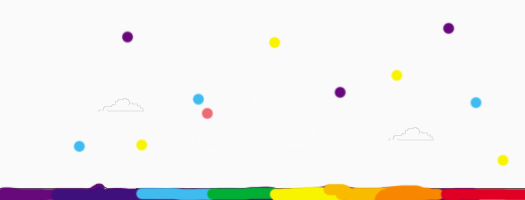

# Projeto Jogo do Dinossauro
Projeto de Jogo Dinossauro "estilo jogo do google chrome" criado durante o Bootcamp da DIO "Órbi Web Games Developer"

## Descrição do Projeto
Este projeto foi construido utilizando Html, CSS e JavaScript

## Como executar
Fazer o Download do Projeto, e abrir o arquivo index.html em um navegador da sua preferência

## Tela inicial do Jogo

Para jogar clique na tecla espaço para pular

## Estilo
O Jogo foi inspirado nas cores do arco íris.

